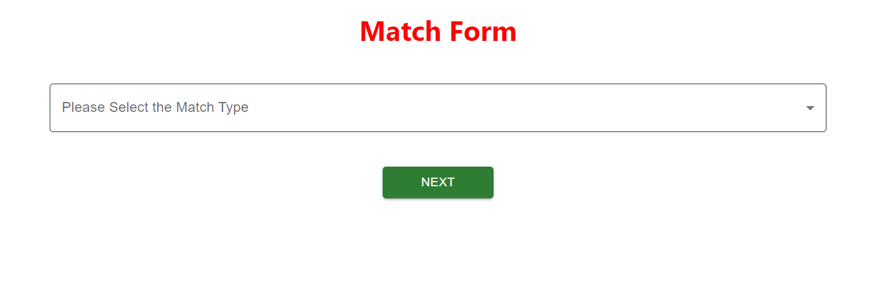
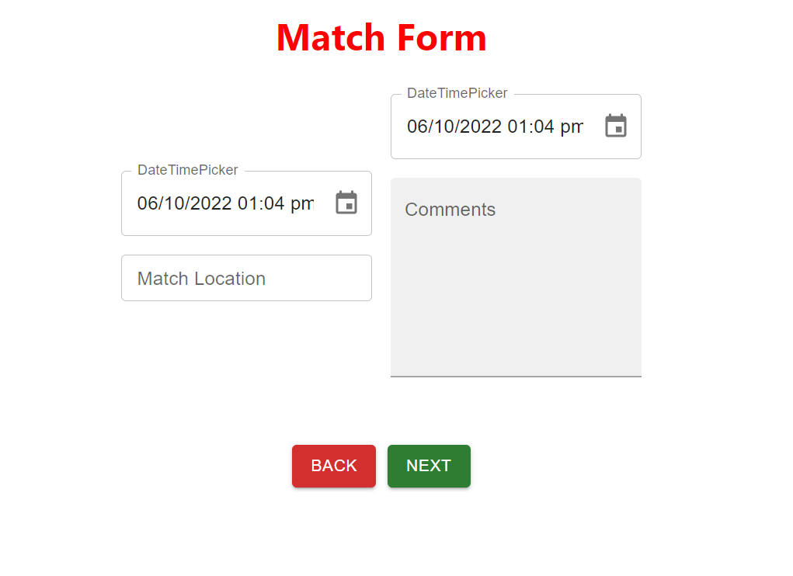
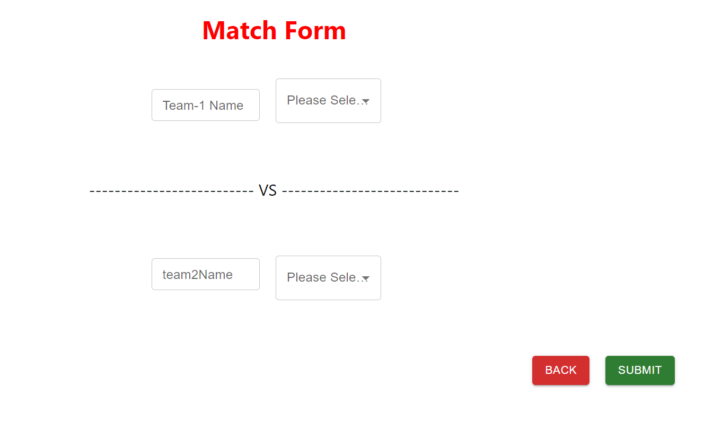
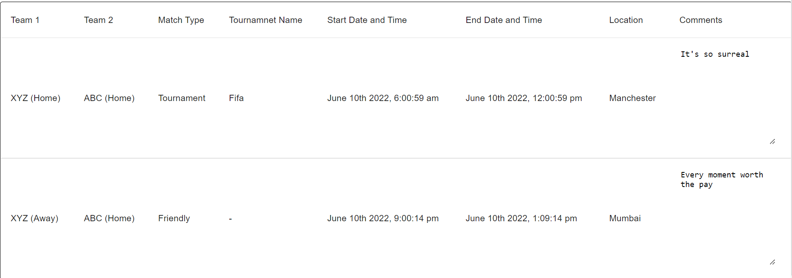

# Match Events

## Images:

## Tech Stack Used:

1. ReactJS as frondend
2. ContextAPI for State Management
3. Material UI for Components
4. Plain CSS for little bit of styling
5. MomentJS for Date and Time
